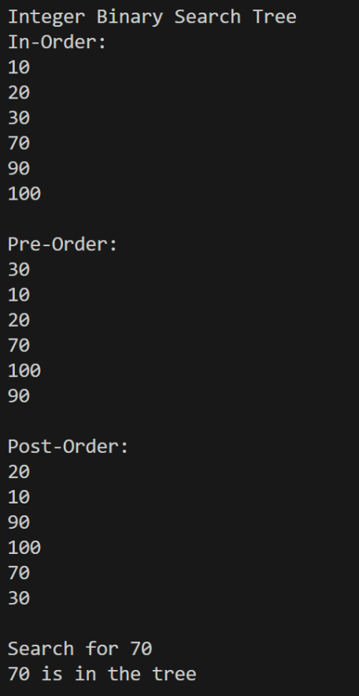
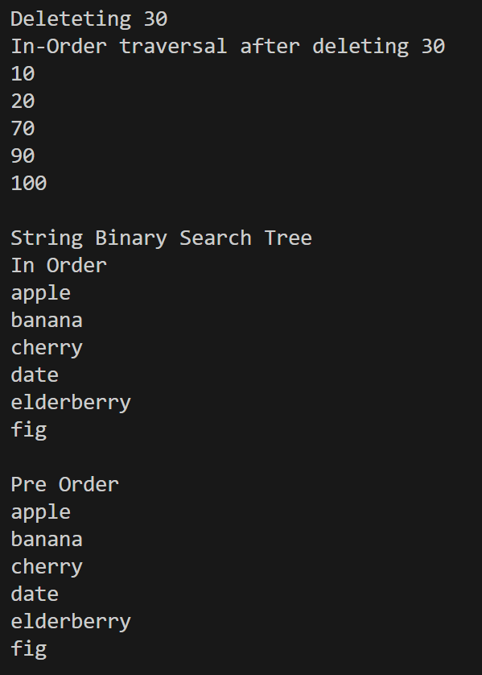
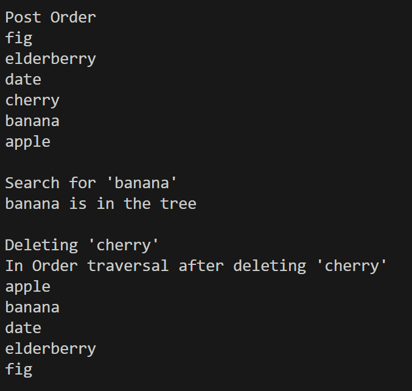

# Assignment: Generic Classes

## About
This repo is a modification of [CSC263 BinaryTree](https://github.com/pchapman-uat/CSC263-BinaryTree/tree/main), changed to be a Generic Binary Search Tree Class.
## Objective
Based on your knowledge of Trees, give an implementation of the Generic Binary Search Tree Class.  
## Demo

